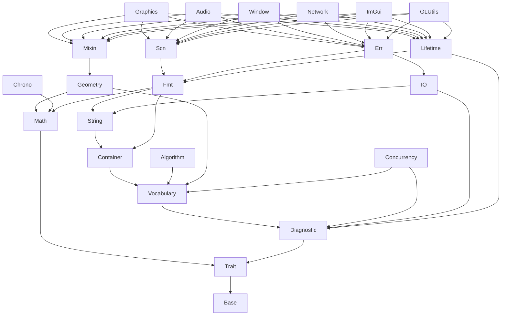

# Zancle Modularization Plan

> A proposal to restructure `ZancleBase/` and `Zancle/System/` into a flat,
> levelized set of topic-named modules under a single `za::` namespace.

## 1. Goals

1. **Eliminate the `ZA_*` / `ZA_*` visual-similarity problem at the structural
   level**, by using a single namespace (`za::`) and letting the file path
   carry the topic information instead.
2. **Levelize** the module graph (à la John Lakos): a strict linear DAG
   where every module depends only on lower-level modules. No cycles.
3. **Balance modularization vs cardinality**: enough modules that each one
   has a single coherent purpose; few enough that the project is navigable.
4. **Flat structure**: every module is a sibling under `include/Zancle/`.
   No nested topical sub-modules. The only permitted subdirectory inside
   a module is `Priv/` for implementation details users should not include
   directly.

## 2. Design principles

- **One namespace**: every type / function / macro lives in `za::` (or
  `za::priv::` for internals). The current `zb::` namespace and the
  `ZancleBase/` include root go away.
- **One macro prefix**: `ZA_*` (and `ZA_PRIV_*` for internals). The current
  `ZA_*` family becomes `ZA_*`.
- **Module = include root sibling**: `<Zancle/Container/Vector.hpp>`,
  `<Zancle/Math/Sin.hpp>`, etc. Each module has its own `CMakeLists.txt`,
  its own `Export.hpp`, and its own static library when convenient
  (`zancle-container`, `zancle-math`, ...).
- **Levelization**: a module at level *N* may only `#include` from modules
  at levels *0..N-1*, never from siblings at level *N* or from any module
  at level *N+1* or higher. This is enforced by convention and audited by
  a small `tools/check_levels.sh` script (future work).
- **Topical, not tiered**: there is no longer a "base" vs "domain" split.
  Multimedia modules (`Graphics`, `Audio`, `Window`, `Network`, `ImGui`,
  `GLUtils`) sit at the **top** of the level graph as the highest-level
  consumers of the utility modules below.
- **Priv subfolder for implementation details**: each module may have a
  `Priv/` subdir for headers users should not include. Public headers
  live at the module root.

## 3. Module catalogue

Below is the proposed module set, each described by its purpose, what
moves into it from the current tree, and its dependency floor.

| # | Module | Purpose | Dep floor |
|---|---|---|---|
| 1 | **Base** | Compiler intrinsics, primitive type aliases, low-level macros, forward declarations of `std::` types | (none) |
| 2 | **Trait** | Type traits and compile-time reflection | Base |
| 3 | **Math** | Mathematical constants, scalar math functions, clamp/min/max | Base, Trait |
| 4 | **Diagnostic** | Assertions, abort, stack traces | Base, Trait |
| 5 | **Vocabulary** | Optional, Variant, Span, FunctionRef, FixedFunction, UniquePtr, ScopeGuard, PassKey, and related single-value wrappers | Base, Trait, Diagnostic |
| 6 | **Container** | Array, Vector, InPlaceVector, ChunkedVector, SmallVector, Bitset, EnumArray, hash map | Base, Trait, Diagnostic, Vocabulary |
| 7 | **Algorithm** | `find`, `sort`, `copy`, `unique`, `rotate`, ...  (free functions on iterator pairs) | Base, Trait, Vocabulary |
| 8 | **String** | StringView, String, UTF utilities, char/numeric ↔ string conversion | Base, Trait, Diagnostic, Vocabulary, Container |
| 9 | **Geometry** | Vec2, Vec3, Rect2, Angle, RectPacker | Base, Trait, Math, Vocabulary |
| 10 | **Chrono** | Time, Clock, SuspendAwareClock, `std::chrono` interop | Base, Trait, Math |
| 11 | **Concurrency** | Atomic, AtomicMutex, LockGuard, Thread, ThreadPool | Base, Trait, Diagnostic, Vocabulary |
| 12 | **Fmt** | Formatting (sinks, specs, numeric/string formatters, format-to-string) | Base, Trait, Math, Vocabulary, Container, String |
| 13 | **IO** | InputStream abstraction, FileInputStream, MemoryInputStream, Path, filesystem helpers | Base, Trait, Diagnostic, Vocabulary, String |
| 14 | **Scn** | Scanning / parsing (numeric, string, stdin) | Base, Trait, Vocabulary, Container, String, Fmt |
| 15 | **Err** | Multimedia error reporting and formatted error scopes | Base, Trait, Diagnostic, Fmt, IO |
| 16 | **Lifetime** | Optional run-time lifetime-dependency tracker (compile-time-disabled by default) | Base, Trait, Diagnostic, Fmt |
| 17 | **Mixin** | Re-usable mixin templates: anchor points, etc. | Base, Trait, Math, Geometry |

The existing multimedia modules -- **Graphics, Audio, Window, Network,
ImGui, GLUtils, Main** -- remain unchanged in name and location and sit
above level 17 as the top consumers.

## 4. Level graph



The eight levels, summarised:

| Level | Modules |
|---|---|
| 0 | Base |
| 1 | Trait |
| 2 | Math, Diagnostic |
| 3 | Vocabulary |
| 4 | Container, Algorithm, Geometry, Chrono |
| 5 | String, Concurrency, Mixin |
| 6 | Fmt, IO |
| 7 | Scn, Err, Lifetime |
| 8+ | Graphics, Audio, Window, Network, ImGui, GLUtils, Main |

## 5. File allocation

What moves where. (Anything currently in `Zancle/<Module>/` for an
unchanged multimedia module is unaffected.)

### 5.1 `Zancle/Base/`

Compiler-intrinsic wrappers, type aliases, low-level macros, foundational
language primitives, forward declarations of `std::` types.

```
Macros.hpp                      (← Zancle/Base/Macros.hpp)
TokenPaste.hpp                  (← Zancle/Base/TokenPaste.hpp)
RequireDesignatedInitializers.hpp
TrivialAbi.hpp

IntTypes.hpp                    (← Zancle/Base/IntTypes.hpp)
FloatTypes.hpp
SizeT.hpp
PtrDiffT.hpp
UIntPtrT.hpp
MaxAlignT.hpp

DeclVal.hpp                     (← Zancle/Base/DeclVal.hpp)
PlacementNew.hpp
Launder.hpp
Exchange.hpp
Swap.hpp

IndexSequence.hpp
MakeIndexSequence.hpp
InitializerList.hpp
SourceLocation.hpp
InterferenceSize.hpp
GetArraySize.hpp
TypePackElement.hpp
TypePackIndex.hpp
NonDeduced.hpp

BitCast.hpp                     (← Zancle/Base/* -- flat into Base/)
Bswap64.hpp
Clzll.hpp
Ctzll.hpp
IsInf.hpp
IsNan.hpp
Memcmp.hpp
Memcpy.hpp
Memmove.hpp
Memset.hpp
OffsetOf.hpp
Popcountll.hpp
Pragma.hpp
Prefetch.hpp
Restrict.hpp
Signbit.hpp
Strcmp.hpp
Strlen.hpp
Strncmp.hpp
Strncpy.hpp
Strstr.hpp
Unreachable.hpp

FwdStdAlignedNewDelete.hpp
FwdStdHash.hpp
FwdStdLocale.hpp
FwdStdString.hpp
```

### 5.2 `Zancle/Trait/`

The existing `Zancle/Trait/` headers, flattened, plus `MiniPFR`.

```
AddConst.hpp, AddLvalueReference.hpp, AddPointer.hpp,
CommonType.hpp, Conditional.hpp, CopyCV.hpp, Decay.hpp,
EnableIf.hpp, HasVirtualDestructor.hpp,
IsAggregate.hpp, IsArray.hpp, IsAssignable.hpp, IsBaseOf.hpp,
IsConst.hpp, IsConstructible.hpp, IsConvertible.hpp,
IsCopyAssignable.hpp, IsCopyConstructible.hpp, IsDefaultConstructible.hpp,
IsEmpty.hpp, IsEnum.hpp, IsFloatingPoint.hpp, IsIntegral.hpp,
IsMemberPointer.hpp, IsMoveAssignable.hpp, IsMoveConstructible.hpp,
IsNothrowMoveAssignable.hpp, IsNothrowMoveConstructible.hpp,
IsNothrowSwappable.hpp, IsPointer.hpp, IsReference.hpp,
IsRvalueReference.hpp, IsSame.hpp, IsStandardLayout.hpp,
IsTrivial.hpp, IsTriviallyAssignable.hpp, IsTriviallyConstructible.hpp,
IsTriviallyCopyable.hpp, IsTriviallyCopyAssignable.hpp,
IsTriviallyCopyConstructible.hpp, IsTriviallyDestructible.hpp,
IsTriviallyMoveAssignable.hpp, IsTriviallyMoveConstructible.hpp,
IsTriviallyRelocatable.hpp, IsUnion.hpp, IsUnsigned.hpp, IsVoid.hpp,
MakeUnsigned.hpp, RemoveConst.hpp, RemoveCV.hpp, RemoveCVRef.hpp,
RemoveReference.hpp, UnderlyingType.hpp, VoidT.hpp, RegularizeVoid.hpp

MiniPFR.hpp                     (← Zancle/Trait/MiniPFR.hpp -- aggregate reflection)
```

### 5.3 `Zancle/Math/`

Math constants, scalar functions, clamp/min/max, epsilon and limits.

```
Constants.hpp
FloatEpsilon.hpp
FloatMax.hpp
DoubleMax.hpp
LongDoubleMax.hpp
Clamp.hpp
ClampMacro.hpp
MinMax.hpp
MinMaxMacros.hpp
Remainder.hpp
SinCosLookup.hpp

Acos.hpp, Asin.hpp, Atan.hpp, Atan2.hpp,
Ceil.hpp, Cos.hpp, Cosh.hpp, Exp.hpp, Fabs.hpp,
Floor.hpp, Fmax.hpp, Fmin.hpp, Fmod.hpp,
Frexp.hpp, Ldexp.hpp, Log.hpp, Log10.hpp,
Lround.hpp, Pow.hpp, Rint.hpp, Round.hpp,
Sin.hpp, Sqrt.hpp, Tan.hpp,

Priv/ConstexprSinCos.hpp
Priv/SinCosLookupTable.inl
Priv/Impl.hpp
```

### 5.4 `Zancle/Diagnostic/`

Assertions, abort, stack traces.

```
Assert.hpp                      (← Zancle/Diagnostic/Assert.hpp)
AssertAndAssume.hpp
Abort.hpp
StackTrace.hpp                  (header for current src/ZancleBase/StackTrace.cpp)
```

### 5.5 `Zancle/Vocabulary/`

Single-value wrappers and basic vocabulary types.

```
Optional.hpp                    (← Zancle/Vocabulary/Optional.hpp)
Variant.hpp
Span.hpp
FunctionRef.hpp
FixedFunction.hpp
OverloadSet.hpp
UniquePtr.hpp
ScopeGuard.hpp
PassKey.hpp
InPlacePImpl.hpp
EnumClassBitwiseOps.hpp
Radix.hpp
```

### 5.6 `Zancle/Container/`

Statically-sized and dynamically-sized collections.

```
Array.hpp                       (← Zancle/Container/Array.hpp)
EnumArray.hpp
Bitset.hpp
Vector.hpp
InPlaceVector.hpp
SmallVector.hpp
ChunkedVector.hpp
AnkerlUnorderedDense.hpp        (hash map)
BackInserter.hpp

Priv/VectorUtils.hpp
```

### 5.7 `Zancle/Algorithm/`

Free functions on iterator ranges.

```
AdjacentFind.hpp                (← Zancle/Algorithm/*)
AllOf.hpp, AnyOf.hpp,
Copy.hpp, Count.hpp,
Erase.hpp, Find.hpp,
IsSorted.hpp, MaxElement.hpp,
Remove.hpp, Rotate.hpp,
Shuffle.hpp, Sort.hpp,
SwapAndPop.hpp, Unique.hpp
```

### 5.8 `Zancle/String/`

String types and char-level numeric I/O.

```
StringView.hpp                  (← Zancle/String/StringView.hpp)
StringViewSplits.hpp
StringViewStreamOp.hpp
String.hpp
StringStreamOp.hpp
Utf.hpp                         (← Zancle/String/Utf.hpp)
Utf8String.hpp
Utf8StringCodepoints.hpp

FromChars.hpp                   (← Zancle/String/FromChars.hpp)
FromCharsRadix.hpp
FromCharsResult.hpp
ToChars.hpp
ToCharsRadix.hpp
ToString.hpp
```

### 5.9 `Zancle/Geometry/`

Math primitives for space and packing.

```
Vec2.hpp                        (← Zancle/Geometry/Vec2.hpp)
Vec3.hpp
Rect2.hpp
RectUtils.hpp
Angle.hpp
AutoWrapAngle.hpp
RectPacker.hpp

Priv/Vec2Base.hpp               (← Zancle/System/Priv/*)
Priv/Vec2Math.hpp
```

### 5.10 `Zancle/Chrono/`

Time and clocks.

```
Time.hpp                        (← Zancle/Chrono/Time.hpp)
Clock.hpp
SuspendAwareClock.hpp
TimeChronoUtil.hpp
StdChrono.hpp                   (← Zancle/Chrono/StdChrono.hpp)
```

### 5.11 `Zancle/Concurrency/`

Atomics, locks, threads, pools.

```
Atomic.hpp                      (← Zancle/Concurrency/Atomic.hpp)
AtomicMutex.hpp
LockGuard.hpp
Thread.hpp
ThreadPool.hpp                  (← Zancle/Concurrency/ThreadPool.hpp)
```

### 5.12 `Zancle/Fmt/`

Formatting machinery.

```
Fmt.hpp                         (← Zancle/Fmt/Fmt.hpp)
FmtSink.hpp, FmtSinkRef.hpp,
FmtSpec.hpp, FmtString.hpp,
FmtSpan.hpp, FmtCString.hpp,
FmtNumeric.hpp, FmtToString.hpp,
FmtResult.hpp,
FmtAppendMixin.hpp,
FmtAppendMixinFwd.hpp,
FmtArgDefaultAlign.hpp
```

### 5.13 `Zancle/IO/`

Streams and filesystem.

```
InputStream.hpp                 (← Zancle/IO/InputStream.hpp)
FileInputStream.hpp
MemoryInputStream.hpp
IO.hpp                          (← Zancle/IO/IO.hpp)
Path.hpp
PathStreamOp.hpp
```

### 5.14 `Zancle/Scn/`

Scanning / parsing.

```
Scn.hpp                         (← Zancle/Scn/Scn.hpp)
ScnCore.hpp
ScnChar.hpp
ScnNumeric.hpp
ScnString.hpp
ScnStringSource.hpp
ScnStdin.hpp
```

### 5.15 `Zancle/Err/`

Multimedia error reporting.

```
Err.hpp                         (← Zancle/Err/Err.hpp)
FmtPath.hpp                     (← Zancle/Err/FmtPath.hpp -- depends on Path, kept here)
```

### 5.16 `Zancle/Lifetime/`

Resource-graph lifetime tracking.

```
LifetimeDependant.hpp           (← Zancle/Lifetime/LifetimeDependant.hpp)
LifetimeDependee.hpp
```

### 5.17 `Zancle/Mixin/`

Re-usable mixin templates.

```
GlobalAnchorPointMixin.hpp      (← Zancle/Mixin/GlobalAnchorPointMixin.hpp)
LocalAnchorPointMixin.hpp
```

### 5.18 What disappears

The two existing top-level roots disappear:

- `include/ZancleBase/` -- fully dissolved into the modules above.
- `include/Zancle/System/` -- fully dissolved. The leftovers
  (`NativeActivity.hpp`, `WindowsHeader.hpp`, `Export.hpp`) move:
    - `NativeActivity.hpp` → `Zancle/Window/` (it is the Android
      multimedia bridge -- domain-appropriate).
    - `WindowsHeader.hpp` → `Zancle/Base/` (cross-cutting platform glue
      used by Base's intrinsic wrappers).
    - `Export.hpp` → each module gets its own.

## 6. Namespace and macro mapping

| Old | New |
|---|---|
| `zb::Vector`, `zb::Optional`, etc. | `za::Vector`, `za::Optional`, etc. |
| `zb::priv::*` | `za::priv::*` |
| `ZA_ASSERT` | `ZA_ASSERT` |
| `ZA_IS_SAME` | `ZA_IS_SAME` |
| `ZA_BASE_API` (export macro) | per-module: `ZA_BASE_API`, `ZA_MATH_API`, ... |

Every existing `zb::` identifier becomes `za::` (the codebase already
uses `za::` for half of its types; this completes the unification). The
single-namespace decision retroactively justifies dropping the `zb::`
alias entirely.

## 7. CMake / build target shape

Each module gets one CMake target (`zancle-base`, `zancle-trait`, ...).
Header-only modules become `INTERFACE` libraries; modules with `.cpp`
files become `STATIC` libraries (toggleable to `SHARED`).

```cmake
add_library(zancle-base INTERFACE)
add_library(Zancle::Base ALIAS zancle-base)
target_include_directories(zancle-base INTERFACE include)

add_library(zancle-trait INTERFACE)
add_library(Zancle::Trait ALIAS zancle-trait)
target_link_libraries(zancle-trait INTERFACE Zancle::Base)

# ... and so on, in level order.
```

A convenience umbrella target `Zancle::Core` aggregates the utility
modules (levels 0-7) for users who want everything-but-multimedia:

```cmake
add_library(zancle-core INTERFACE)
add_library(Zancle::Core ALIAS zancle-core)
target_link_libraries(zancle-core INTERFACE
    Zancle::Base Zancle::Trait Zancle::Math Zancle::Diagnostic
    Zancle::Vocabulary Zancle::Container Zancle::Algorithm Zancle::String
    Zancle::Geometry Zancle::Chrono Zancle::Concurrency
    Zancle::Fmt Zancle::IO Zancle::Scn Zancle::Err
    Zancle::Lifetime Zancle::Mixin)
```

## 8. Convention enforcement

A `tools/check_levels.sh` script (future work) walks every header in
each module and asserts:

1. It only `#include`s headers from modules at strictly lower levels.
2. No header outside `Zancle/<Module>/Priv/` is included from outside
   the module.
3. No `using namespace ...;` at file scope.
4. Header guards / namespaces follow the `ZA_<MODULE>_*` convention.

This makes the levelization machine-checked rather than convention-only.

## 9. Migration approach

One large commit per phase to keep the bisectable:

1. **Scaffold** the empty new module dirs under `include/Zancle/` and
   `src/Zancle/`, with empty `CMakeLists.txt` files declaring the targets
   and their `Zancle::*` aliases. Build passes (no targets used yet).
2. **Move files** in batches by module, lowest level first (Base →
   Trait → Math → ...). Each move is a `git mv` + a sed pass rewriting the
   include paths repo-wide. Build after each.
3. **Rename namespaces** `zb::` → `za::` in one sed pass across the
   codebase. Build, fix any straggler ambiguities (e.g. `za::priv::*`
   that previously coexisted as `zb::priv::*`).
4. **Rename macros** `ZA_*` → `ZA_*` in one sed pass.
5. **Retire the old roots**: `git rm -r include/ZancleBase include/Zancle/System`.
6. **Update the .clang-format `IncludeCategories`** to match the new
   module layout (priorities ordered by level).
7. **Update `tools/rebrand/`** scripts so they describe the new layout
   for any future contributor doing a fresh migration.

Estimated effort: ~one focused day, similar to the original ZancleBase
migration. The bulk is sed + build cycles.

## 10. Open questions and trade-offs

### 10.1 Should `Mixin` exist as its own module?

It has two files. Two arguments for keeping it separate:

- Mixins are a *form*, not a topic, but their *placement* doesn't fit
  cleanly anywhere else: they're graphics-shaped (anchor points), so
  not Geometry; they're not multimedia-domain, so not Graphics.
- Future mixins (transformable mixins, batchable mixins) could land here.

An equally defensible alternative is to fold the anchor mixins into
`Zancle/Graphics/` since they describe a graphics convention. That's a
final-mile call.

### 10.2 Should `Err` and `Lifetime` merge into a `Debug` or `Diagnostic` module?

Both are small. Merging them with `Diagnostic` (currently Assert + Abort)
would give a single "things related to debugging and error visibility"
module. The cost is that `Diagnostic` is currently at level 2; folding
in Err+Lifetime would bump it to level 7, weakening its early-level
availability.

The proposal keeps them separate.

### 10.3 Should `Scn` and `Fmt` merge into a `Text` module?

They are symmetric (output / input formatting). Merging would reduce
module count to 16. Argument against: Fmt is at level 6, Scn at level 7
(Scn depends on Fmt). A merge would create internal complexity at the
module boundary.

The proposal keeps them separate.

### 10.4 What about the `Window` / `Audio` / `Graphics` modules?

Out of scope for this document. They sit above level 7 as the top
consumers of the utility modules. Their internal layout is unchanged.

A follow-up audit may decide that `Zancle/Window/NativeActivity.hpp`
and similar Android-specific headers want a `Zancle/Platform/` module,
but that is a separate piece of work.

### 10.5 Header-only vs `.cpp`-bearing modules

Most utility modules are header-only. A few have `.cpp` implementations:

- **Diagnostic**: StackTrace (libbacktrace integration)
- **Math**: SinCos lookup table generation
- **String**: String, UTF
- **Concurrency**: AtomicWait, Thread
- **Geometry**: Vec2, Vec3, Rect, RectPacker
- **Chrono**: Clock
- **Fmt**: Fmt, FmtNumeric
- **IO**: Path, FileInputStream, MemoryInputStream, IO
- **Scn**: ScnStdin
- **Lifetime**: LifetimeDependant, LifetimeDependee, LifetimeTrackingABICheck

Each of these gets a STATIC library target, named `zancle-<module>`.

## 11. Summary

- **17 utility modules**, levelized into **8 dependency levels**, plus the
  unchanged multimedia modules sitting above them.
- **One namespace** (`za::`) and **one macro prefix** (`ZA_*`).
- **Flat layout**: each module has public headers at its root and
  internals in `Priv/`. No nested topical sub-modules.
- The current `ZancleBase/` and `Zancle/System/` roots disappear entirely.
- Migration cost ≈ the same as the original `ZancleBase` extraction:
  ~one day, mechanical, sed-driven, build-verified at each step.
